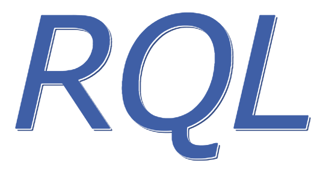

<p align="center">
	
	<br/>
	<a href="https://godoc.org/github.com/a8m/rql">
		
	</a>
	<a href="LICENSE">
		
	</a>
	<a href="https://travis-ci.org/a8m/rql">
		
	</a>
</p>

RQL is a resource query language for REST. It provides a simple and light-weight API for adding dynamic querying capabilities to web-applications that use SQL-based database. It functions as the connector between the HTTP handler and the DB engine, and manages all validations and translations for user inputs.

<p align="center">
  
</p>

## Motivation
In the last several years I have found myself working on different web applications in Go, some of them were small and some of them were big with a lot of entities and relations. In all cases I never found a simple and standard API to query my resources.

What do I mean by query? Let's say our application has a table of `orders`, and we want our users to be able to search and __filter by dynamic parameters__. For example: _select all orders from today with price greater than 100_.  
In order to achieve that I used to pass these parameters in the query string like this: `created_at_gt=X&price_gt=100`.  
But sometimes it became complicated when I needed to apply a disjunction between two conditions. For example, when I wanted to _select all orders that canceled or created last week and still didn't ship_. And in SQL syntax:
```sql
SELECT * FROM ORDER WHERE canceled = 1 OR (created_at < X AND created_at > Y AND shipped = 0)
```  
I was familiar with the MongoDB syntax and I felt that it was simple and robust enough to achieve my goals, and decided to use it as the query language for this project. I wanted it to be project agnostic in the sense of not relying on anything that related to some specific application or resource. Therefore, in order to embed rql in a new project, a user just needs to import the package and add the desired tags to his struct definition. Follow the [Getting Started](#Getting_Started) section to learn more.

## Getting Started
rql uses a subset of MongoDB query syntax. If you are familiar with the MongoDB syntax, it will be easy for you to start. Although, it's pretty simple and easy to learn.    
In order to embed rql you simply need to add the tags you want (`filter` or `sort`) to your struct definition, and rql will manage all validations for you and return an informative error for the end user if the query doesn't follow the schema.
Here's a short example of how to start using rql quickly, or you can go to [API](#API) for more expanded documentation.
```go
// An example of an HTTP handler that uses gorm, and accepts user query in either the body
// or the URL query string.
package main

var (
	db *gorm.DB
	// QueryParam is the name of the query string key.
	QueryParam = "query"
	// MustNewParser panics if the configuration is invalid.
	QueryParser = rql.MustNewParser(rql.Config{
		Model:    User{},
		FieldSep: ".",
	})
)

// User is the model in gorm's terminology.
type User struct {
	ID          uint      `gorm:"primary_key" rql:"filter,sort"`
	Admin       bool      `rql:"filter"`
	Name        string    `rql:"filter"`
	AddressName string    `rql:"filter"`
	CreatedAt   time.Time `rql:"filter,sort"`
}


// GetUsers is an http.Handler that accepts a db query in either the body or the query string.
func GetUsers(w http.ResponseWriter, r *http.Request) {
	var users []User
	p, err := getDBQuery(r)
	if err != nil {
		io.WriteString(w, err.Error())
		w.WriteHeader(http.StatusBadRequest)
		return
	}
	err = db.Where(p.FilterExp, p.FilterArgs).
		Offset(p.Offset).
		Limit(p.Limit).
		Order(p.Sort).
		Find(&users).Error
	if err != nil {
		w.WriteHeader(http.StatusInternalServerError)
		return
	}
	if err := json.NewEncoder(w).Encode(users); err != nil {
		w.WriteHeader(http.StatusInternalServerError)
		return
	}
	w.Header().Set("Content-Type", "application/json")
}

// getDBQuery extract the query blob from either the body or the query string
// and execute the parser.
func getDBQuery(r *http.Request) (*rql.Params, error) {
	var (
		b   []byte
		err error
	)
	if v := r.URL.Query().Get(QueryParam); v != "" {
		b, err = base64.StdEncoding.DecodeString(v)
	} else {
		b, err = ioutil.ReadAll(io.LimitReader(r.Body, 1<<12))
	}
	if err != nil {
		return nil, err
	}
	return QueryParser.Parse(b)
}
```
Go to [examples/simple](examples/simple.go) to see the full working example.


## API
In order to start using rql, you need to configure your parser. Let's go over a basic example of how to do this. For more details and updated documentation, please checkout the [godoc](https://godoc.org/github.com/a8m/rql/#Config).  
There are two options to build a parser, `rql.New(rql.Config)`, and `rql.MustNew(rql.Config)`. The only difference between the two is that `rql.New` returns an error if the configuration is invalid, and `rql.MustNew` panics.
```go
// we use rql.MustPanic because we don't want to deal with error handling in top level declarations.
var Parser = rql.MustNew(rql.Config{
	// User if the resource we want to query.
	Model: User{},
	// Since we work with gorm, we want to use its column-function, and not rql default.
	// although, they are pretty the same.
	ColumnFn: gorm.ToDBName,
	// Use your own custom logger. This logger is used only in the building stage.
	Log: logrus.Printf,
	// Default limit returned by the `Parse` function if no limit provided by the user.
	DefaultLimit: 100,
	// Accept only requests that pass limit value that is greater than or equal to 200.
	LimitMaxValue: 200,
})
```
rql uses reflection in the build process to detect the type of each field, and create a set of validation rules for each one. If one of the validation rules fails or rql encounters an unknown field, it returns an informative error to the user. Don't worry about the usage of reflection, it happens only once when you build the parser.
Let's go over the validation rules:
1. `int` (8,16,32,64), `sql.NullInt6` - Round number
2. `uint` (8,16,32,64), `uintptr` - Round number and greater than or equal to 0
3. `float` (32,64), sql.NullFloat64: - Number
4. `bool`, `sql.NullBool` - Boolean
5. `string`, `sql.NullString` - String
6. `time.Time`, and other types that convertible to `time.Time` - The default layout is time.RFC3339 format (JS format), and parsable to `time.Time`.
   It's possible to override the `time.Time` layout format with custom one. You can either use one of the standard layouts in the `time` package, or use a custom one. For example:
   ```go
   type User struct {
		T1 time.Time `rql:"filter"`                         // time.RFC3339
		T2 time.Time `rql:"filter,layout=UnixDate"`         // time.UnixDate
		T3 time.Time `rql:"filter,layout=2006-01-02 15:04"` // 2006-01-02 15:04 (custom)
   }
   ```  

Note that all rules are applied to pointers as well. It means, if you have a field `Name *string` in your struct, we still use the string validation rule for it.

### User API
We consider developers as the users of this API (usually FE developers). Let's go over the JSON API we export for resources.  
The top-level query accepts JSON with 4 fields: `offset`, `limit`, `filter` and `sort`. All of them are optional.

#### `offset` and `limit`
These two fields are useful for paging and they are equivalent to `OFFSET` and `LIMIT` in a standard SQL syntax.
- `offset` must be greater than or equal to 0 and its default value is 0
- `limit` must be greater than   and less than or equal to the configured `LimitMaxValue`.
   The default value for `LimitMaxValue` is 100

#### `sort`
Sort accepts a slice of strings (`[]string`) that is translated to the SQL `ORDER BY` clause. The given slice must contain only columns that are sortable (have tag `rql:"sort"`). The default order for column is ascending order in SQL, but you can control it with an optional prefix: `+` or `-`. `+` means ascending order, and `-` means descending order. Let's see a short example:
```
For input - ["address.name", "-address.zip.code", "+age"]
Result is - address_name, address_zip_code DESC, age ASC
```

#### `select`
Select accepts a slice of strings (`[]string`) that is joined with comma (",") to the SQL `SELECT` clause.
```
For input - ["name", "age"]
Result is - "name, age"
```

#### `filter`
Filter is the one who is translated to the SQL `WHERE` clause. This object that contains `filterable` fields or the disjunction (`$or`) operator. Each field in the object represents a condition in the `WHERE` clause. It contains a specific value that matched the type of the field or an object of predicates. Let's go over them:
- Field follows the format: `field: <value>`, means the predicate that will be used is `=`. For example:
  ```
  For input:
  {
    "admin": true
  }
  
  Result is: admin = ?
  ```
  You can see that RQL uses placeholders in the generated `WHERE` statement. Follow the [examples](#examples) section
  to see how to use it properly. 
- If the field follows the format: `field: { <predicate>: <value>, ...}`, For example:
  ```
  For input:
  {
    "age": {
      "$gt": 20,
      "$lt": 30
    }
  }
  
  Result is: age > ? AND age < ?
  ```
  It means that the logical `AND` operator used between the two predicates.
  Scroll below to see the full list of the supported predicates.
- `$or` is a field that represents the logical `OR` operator, and can be in any level of the query. Its type need to be an
  array of condition objects and the result of it is the disjunction between them. For example:
  ```
  For input:
  {
    "$or": [
      { "city": "TLV" },
      { "zip": { "$gte": 49800, "$lte": 57080 } }
    ]
  }
  
  Result is: city = ? OR (zip >= ? AND zip <= ?)
  ```
To simplify that, the rule is `AND` for objects and `OR` for arrays. Let's go over the list of supported predicates and then we'll show a few examples.

##### Predicates
- `$eq` and `$neq` - can be used on all types
- `$gt`, `$lt`, `$gte` and `$lte` - can be used on numbers, strings, and timestamp
- `$like` - can be used only on type string

If a user tries to apply an unsupported predicate on a field it will get an informative error. For example:
```
For input:
{
  "age": {
    "$like": "%0"
  }
}

Result is: can not apply op "$like" on field "age"
```

## Examples
Assume this is the parser for all examples.
```go

var QueryParser = rql.MustNewParser(rql.Config{
	Model:    	User{},
	FieldSep: 	".",
	LimitMaxValue:	25,
})
	
type User struct {
	ID          uint      `gorm:"primary_key" rql:"filter,sort"`
	Admin       bool      `rql:"filter"`
	Name        string    `rql:"filter"`
	Address     string    `rql:"filter"`
	CreatedAt   time.Time `rql:"filter,sort"`
}
```
#### Simple Example
```go
params, err := QueryParser.Parse([]byte(`{
  "limit": 25,
  "offset": 0,
  "filter": {
    "admin": false
  }
  "sort": ["+name"]
}`))
must(err, "parse should pass")
fmt.Println(params.Limit)	// 25
fmt.Println(params.Offset)	// 0
fmt.Println(params.Sort)	// "name ASC"
fmt.Println(params.FilterExp)	// "name = ?"
fmt.Println(params.FilterArgs)	// [true]
```

In this case you've a valid generated `rql.Param` object and you can pass its to your favorite package connector.

```go
var users []*User

// entgo.io (A type-safe entity framework)
users, err = client.User.Query().
    Where(func(s *sql.Selector) {
        s.Where(sql.ExprP(p.FilterExp, p.FilterArgs...))
    }).
    Limit(p.Limit).
    Offset(p.Offset).
    All(ctx)
must(err, "failed to query ent")

// gorm
err = db.Where(p.FilterExp, p.FilterArgs).
	Offset(p.Offset).
	Limit(p.Limit).
	Order(p.Sort).
	Find(&users).Error
must(err, "failed to query gorm")

// xorm
err = engine.Where(p.FilterExp, p.FilterArgs...).
	Limit(p.Limit, p.Offset).
	OrderBy(p.Sort).
	Find(&users)
must(err, "failed to query xorm")

// go-pg/pg
err = db.Model(&users).
	Where(p.FilterExp, p.FilterArgs).
	Offset(p.Offest).
	Limit(p.Limit).
	Order(p.Sort).
	Select()
must(err, "failed to query pg/orm")

// Have more example? feel free to add.
```

#### Medium Example
```go
params, err := QueryParser.Parse([]byte(`{
  "limit": 25,
  "filter": {
    "admin": false,
    "created_at": {
      "$gt": "2018-01-01T16:00:00.000Z",
      "$lt": "2018-04-01T16:00:00.000Z"
    }
    "$or": [
      { "address": "TLV" },
      { "address": "NYC" }
    ]
  }
  "sort": ["-created_at"]
}`))
must(err, "parse should pass")
fmt.Println(params.Limit)	// 25
fmt.Println(params.Offset)	// 0
fmt.Println(params.Sort)	// "created_at DESC"
fmt.Println(params.FilterExp)	// "admin = ? AND created_at > ? AND created_at < ? AND (address = ? OR address = ?)"
fmt.Println(params.FilterArgs)	// [true, Time(2018-01-01T16:00:00.000Z), Time(2018-04-01T16:00:00.000Z), "TLV", "NYC"]
```


## Future Plans and Contributions
If you want to help with the development of this package, here is a list of options things I want to add
- [ ] JS library for query building
- [ ] Option to ignore validation with specific tag
- [ ] Add `$not` and `$nor` operators
- [ ] Automatically (or by config) filter and sort `gorm.Model` fields
- [ ] benchcmp for PRs
- [ ] Support MongoDB. Output need to be a bison object. here's a [usage example](https://gist.github.com/congjf/8035830)
- [ ] Right now rql assume all fields are flatted in the db, even for nested fields.
  For example, if you have a struct like this:
  ```go
  type User struct {
      Address struct {
          Name string `rql:"filter"`
      }
  }
  ```
  rql assumes that the `address_name` field exists in the table. Sometimes it's not the case and `address` exists in
  a different table. Therefore, I want to add the `table=` option for fields, and support nested queries.
- [ ] Code generation version - low priority

## Performance and Reliability
The performance of RQL looks pretty good, but there is always a room for improvement. Here's the current bench result:

|      __Test__       | __Time/op__    | __B/op__   | __allocs/op__  |
|---------------------|----------------|------------|----------------|
| Small               |    1809        |   960      |   19           |
| Medium              |    6030        |   3100     |   64           |
| Large               |    14726       |   7625     |   148          |

I ran fuzzy testing using `go-fuzz` and I didn't see any crashes. You are welcome to run by yourself and find potential failures. 

## LICENSE
I am providing code in the repository to you under MIT license. Because this is my personal repository, the license you receive to my code is from me and not my employer (Facebook)
